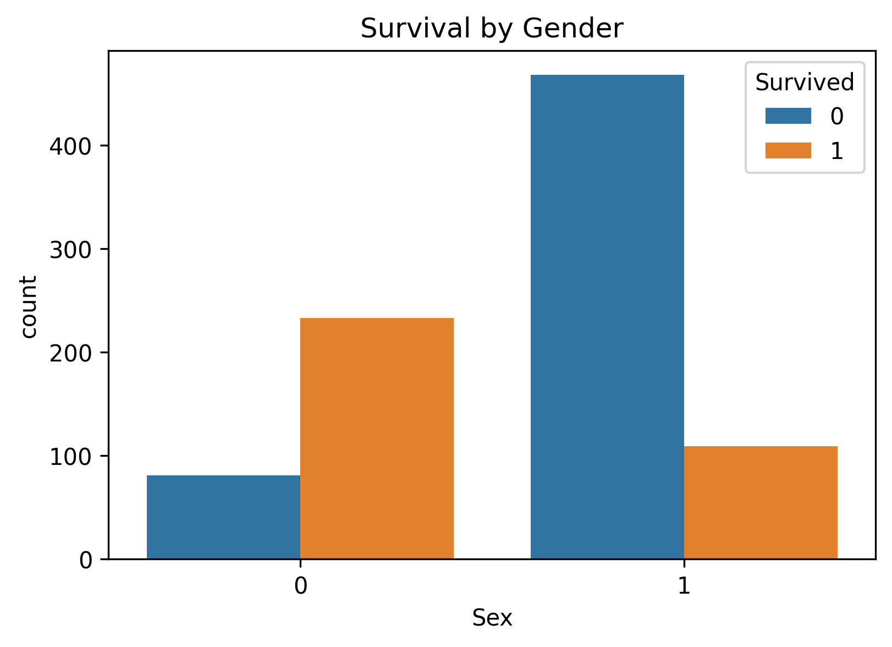
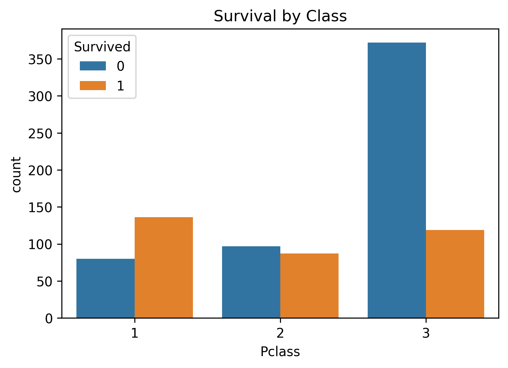
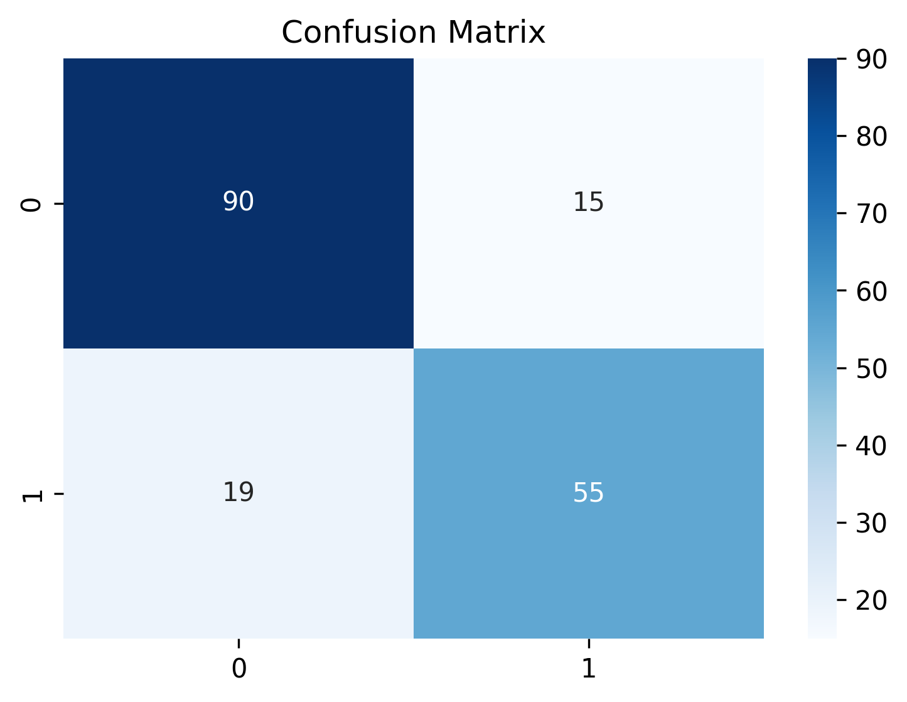
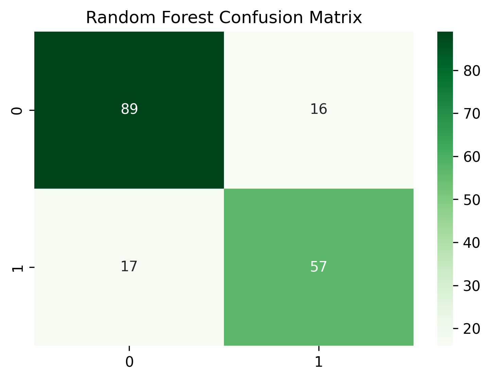
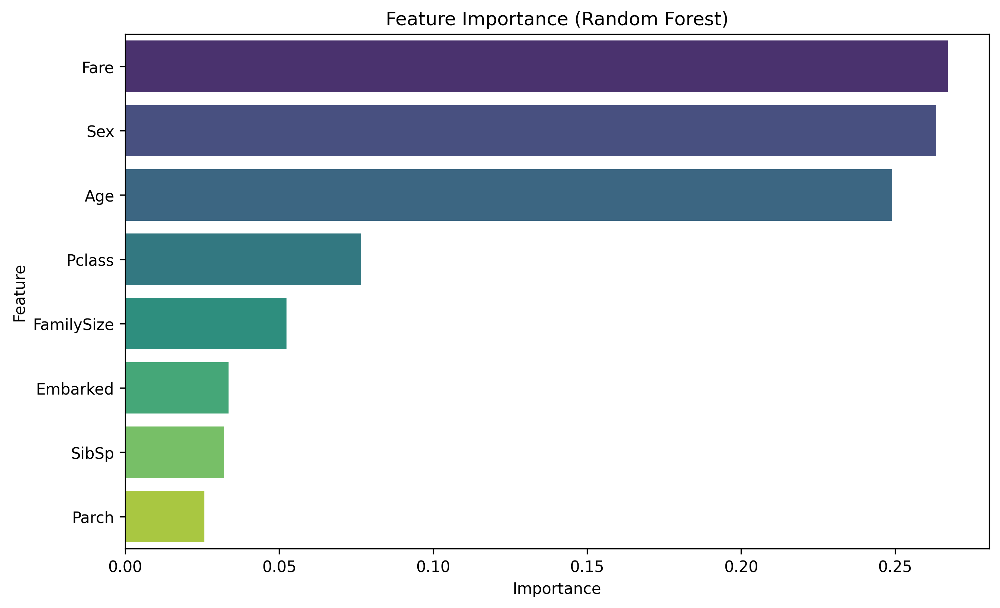

# 🚢 Titanic Survival Prediction

A classic machine learning project using the Kaggle Titanic dataset.  
The goal is to predict whether a passenger survived based on their attributes.  

---

## 📌 Project Overview
- **Dataset:** [Kaggle Titanic Dataset] 
- **Task:** Binary classification (Survived = 0 or 1)  
- **Techniques:** Data Cleaning, Feature Engineering, Machine learning  

---

## ⚙️ Workflow
1. **Exploratory Data Analysis (EDA)**
   - Checked missing values, distributions, correlations  
   - Visualized survival rates by gender, class, and age  

2. **Data Cleaning & Feature Engineering**
   - Filled missing values (`Age`, `Embarked`, `Fare`)  
   - Converted `Sex` into numeric (0 = Male, 1 = Female)  
   - Created `FamilySize` and `IsAlone` features  
   - Extracted passenger `Title` from names  

3. **Modeling**
   - Trained multiple models: Logistic Regression, Decision Tree, KNN, Random Forest  
   - Best model: **Random Forest (~80% validation accuracy)**  
   - Tuned hyperparameters using **GridSearchCV/RandomizedSearchCV**  

4. **Results**
   - **Kaggle Score:** 0.8827  
   - **Most important features:** Sex, Pclass, Title, Fare  

---

## 📊 Visualizations

### Survival by Gender
<p align="center">

</p>

### Survival by Class
<p align="center">

</p>

### Logistic Regression Confusion Matrix
<p align="center">

</p>

### Random Forest Confusion Matrix
<p align="center">

</p>

### Random Forest Feature Importance
<p align="center">

</p>

---

## 🛠️ Requirements
- Python 3.8+  
- pandas, numpy, matplotlib, seaborn  
- scikit-learn, xgboost, jupyter  

Install dependencies:
```bash
pip install -r requirements.txt
```
---

 ## 🚀 How to Run
- You can run this project in Google Colab 

---
## 📄 License
- This project is licensed under the MIT License.  
- You are free to use, modify, and distribute this project for educational or personal purposes.  
- See the [LICENSE](LICENSE) file for details.
